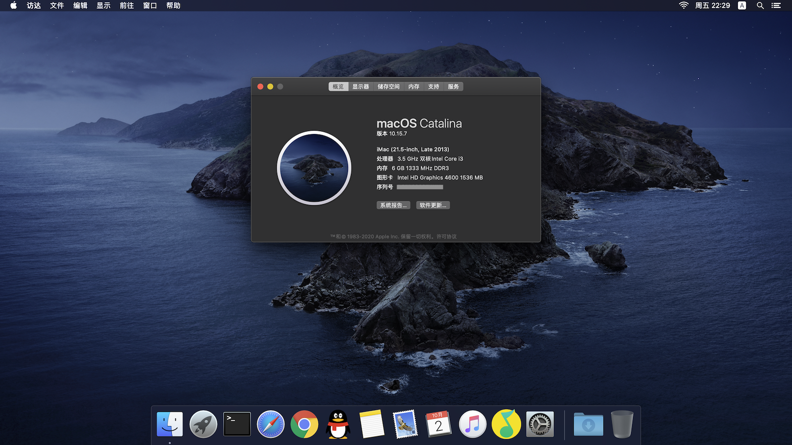

# 联想 ThinkCentre M73 Tiny OpenCore EFI



## 规格

| | |
|-|-|
| 产品序列号 | PC07S4KD |
| 机器型号 | 10AXA2EJJP |
| 详细规格 | <https://support.lenovo.com/us/en/solutions/PD029621> |
| BIOS 版本 | [FHKT85A 23 Jun 2020](https://pcsupport.lenovo.com/us/en/products/desktops-and-all-in-ones/thinkcentre-m-series-desktops/thinkcentre-m73/10ax/10axa2ejjp/pc07s4kd/downloads/DS038325) |
| CPU | [Intel® Core™ i3-4330 Processor](https://ark.intel.com/content/www/us/en/ark/products/77769/intel-core-i3-4330-processor-4m-cache-3-50-ghz.html) |
| 显卡 | Intel® HD Graphics 4600 |
| OpenCore 版本 | 0.6.1 |
| macOS 版本 | *Catalina 10.15*, [Mojave 10.14](https://github.com/qianbinbin/hackintosh-m73-tiny/tree/macOS-Mojave-10.14) |

## 使用方法

1. [创建 USB](https://dortania.github.io/OpenCore-Install-Guide/installer-guide/)。

2. 挂载 USB 中的 EFI 分区（连接电脑时会自动挂载），删除其中所有文件，并把 [EFI 文件夹](BOOT/EFI) 复制进去。

   名为 `BOOT` 的 EFI 分区结构应该形如：

   ```
   BOOT
   └── EFI
       ├── BOOT
       │   └── BOOTx64.efi
       └── OC
           ├── ACPI
           ├── Bootstrap
           ├── Drivers
           ├── Kexts
           ├── OpenCore.efi
           ├── Resources
           ├── Tools
           └── config.plist
   ```

3. 以 `iMac14,1` [生成 SMBIOS 信息](https://dortania.github.io/OpenCore-Install-Guide/config-laptop.plist/haswell.html#platforminfo)，并在 `config.plist` 中设置 `SystemSerialNumber`、`MLB` 和 `SystemUUID` 的值。

4. 如有必要，更新 BIOS 版本。

5. [配置 BIOS](https://dortania.github.io/OpenCore-Install-Guide/config-laptop.plist/haswell.html#intel-bios-settings)。

6. 从 USB 启动，安装 macOS。

7. 可选地加入适当的 [Kexts 文件](https://dortania.github.io/OpenCore-Install-Guide/ktext.html#wifi-and-bluetooth) 来驱动 Intel 无线网卡或非苹果的博通无线网卡。
